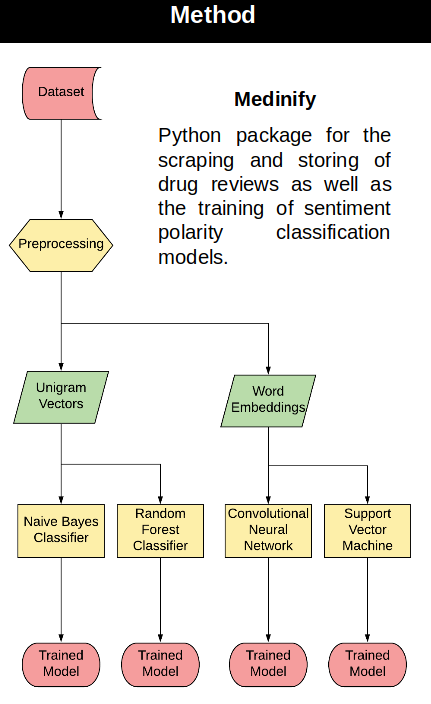

# Medinify


Sentiment analysis for online drug reviews. 
### Scraper/Review Data
Medinify does several things: it has scraper functionality where it takes public drug review data and outputs a csv file with the comment along with the rating data and other metadata.


## Requirements

* Python 3.6

## Getting Started
### Using Git Version Control to grab Medinify
Ensure that you have git installed.  If using Mac open the terminal using ⌘ + T.  Then type into the terminal:
```
git --version
```
This should open a prompt to install git if you don't have it.  
For linux (usually ctrl + alt + t) to open terminal:
```
sudo apt install git
```
Then for either Mac or Linux type into the terminal (to install to current folder don't use the last argument):
```
git clone https://github.com/NanoNLP/medinify [Intended Directory](e.g.: Programs/Programfolder)
```
### Virtual environment setup
In order to manage dependencies/configuration virtual environments are used.  To set one up for this project use the terminal and go to the project installation directory.
From there enter the following commands:

```bash
python3 -m venv venv
source venv/bin/activate
pip install --upgrade pip
pip install -r requirements.txt
pip install -e .
python -m spacy download en_core_web_sm
```
This creates a folder in the directory that contains a python installation for the specific python version and a specific version of the various dependencies for the project.  To check if it worked type:
```
which python
```
It should say something like: 
```text
medinify/venv/bin/python
```
### Installation check via a classifier
To see if it worked we can train a classifier on example drug reviews. Via the terminal go to the project folder and type:
```
python medinify train -r examples/heart_drugs.csv -o out
```
If no errors are generated and an output file was produced the project was successful installed.  By default it ran a naive bayesian classifier on the data set.  


## Datasets

### Review Datasets

Scrape for reviews from WebMD, Drugs.com, DrugRatingz.com, and EverdayHealth.com, save them, load them, get statistics, and export to CSV or JSON.

#### Review Dataset Examples

```python
from medinify.datasets import Dataset

# For saving a Citalopram reviews dataset
dataset = Dataset()
dataset.collect('https://www.webmd.com/drugs/drugreview-1701-citalopram-oral.aspx?drugid=1701&drugname=citalopram-oral')
dataset.save_data('output.pkl')
```

```python
from medinify.datasets import Dataset

# Load a saved citalopram dataset, cleanse the data, write CSV, and print stats
dataset = Dataset()
dataset.load_data('output.pkl')
dataset.generate_ratings()
dataset.write_file('output.csv')
dataset.print_stats()
```

## Classifiers

### Review Classifier

Train and test a model for running sentiment analysis on drug reviews. Models can currently use Naive Bayes, Decision Tree, or a Tensorflow Neural Network.

#### Naive Bayes 
Required arguments: Drug review file csv, output file

 A probabilistic supervised machine learning algorithm that takes into account the frequency of positive and negative words
### Neural Network 
### Random Forest 
Ensemble machine learning algorithm which generates a series of decision trees and classifies based on the mean output of each tree
### Support Vector Machine 
Generates a hyperplane for separating data into two categories, positive or negative

#### Review Classifier Examples

```python
from medinify.sentiment import Classifier

# Train a use a classifier if you already have a Citalopram dataset
classifier = Classifier('nb')
classifier.fit(output_file='model.pkl', reviews_file='citalopram-reviews.csv')
classifier.validate('citalopram-reviews.csv', k_folds=5)
classifier.classify(reviews_csv='neutral.txt', output_file='classified.txt', trained_model_file='model.pkl')
```

## Contributions

### Checklist

* Changes made/comitted/pushed in new branch
* Changes not far behind master
* Added comments and documentation to code
* Made sure styling matches Google style guide: <http://google.github.io/styleguide/pyguide.html>
* README updated if relevant changes made

### Making changes locally

1. Copy the URL from the Medinify repository and use Git to clone the repo:

    ```bash
    # Clone the repo into current directory
    git clone https://github.com/NanoNLP/medinify.git
    # Navigate to the newly cloned directory
    cd medinify
    ```

2. Create a branch off of develop to contain your changes:

    ```bash
    git checkout -b <new-branch-name>
    ```

3. After making changes to files or adding new files to the project, stage your changes

    ```bash
    git add <filename>
    ```

4. Next, we record the changes made and provide a message describing the changes made so others can understand

    ```bash
    git commit -m "Description of changes made"
    ```

5. After committitng, make sure everything looks good with:

    ```bash
    git status
    ```

    and you will recieve an output similar to this:

    ```bash
    On branch <new-branch-name>
    Your branch is ahead of 'origin/<new-branch-name>' by 1 commit.
    (use "git push" to publish your local commits)
    nothing to commit, working directory clean
    ```

6. Finally, push the changes to the new branch origin:

```bash
# If the branch doesn't exist on GitHub yet
git push --set-upstream origin test

# If the branch already exists
git push
```

### Making Pull Requests

After following the steps above, you can make a pull request directly on the Medinify GitHub. It should be a pull request to merge your new branch into develop.

Add a title, a description, and then press the “Create pull request” button. If you are closing an issue, put "closes #14", if you had issue 14.

Navigate to the reviewers tab and request a reviewer to review the PR.

### Authors

Bridget McInnes, Jorge Vargas, Gabby Gurdin, Nathan West, Ishaan Thakur, Mark Groves

## More Info

* [VCU Natural Language Processing Lab](https://nlp.cs.vcu.edu/)     
* [Nanoinformatics Vertically Integrated Projects](https://rampages.us/nanoinformatics/)
